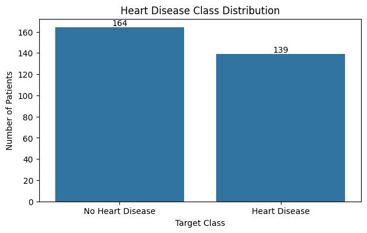
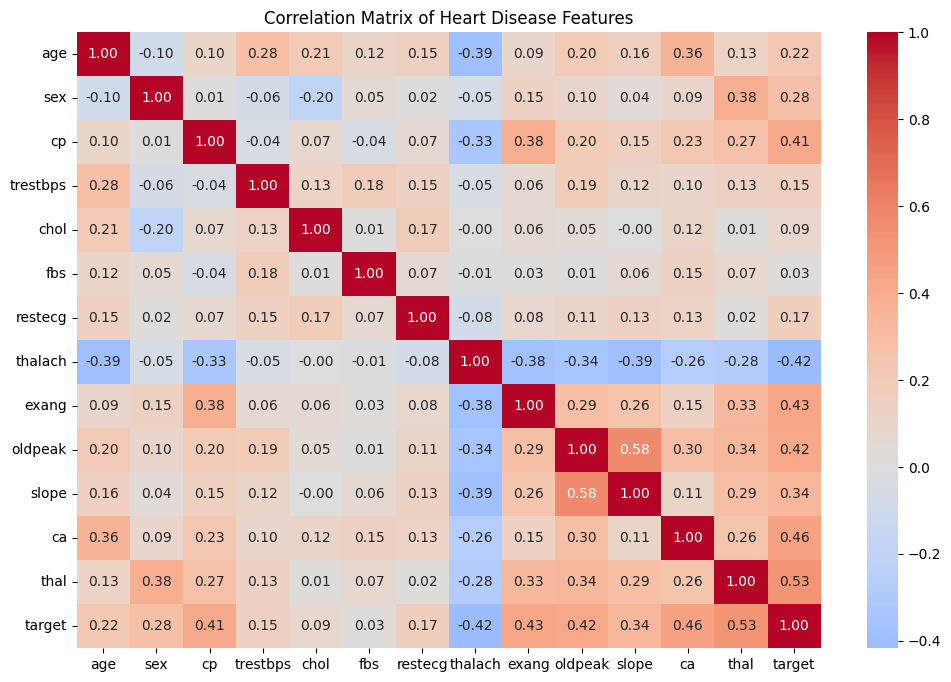
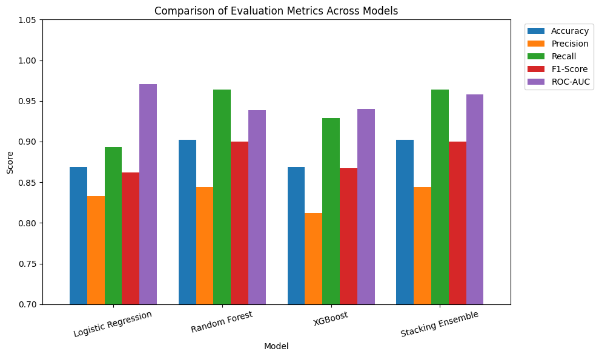
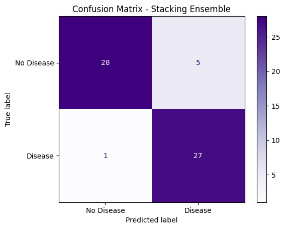
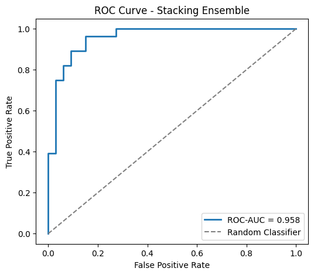
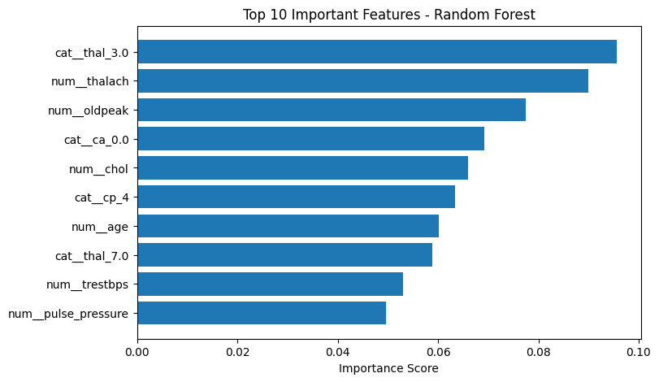
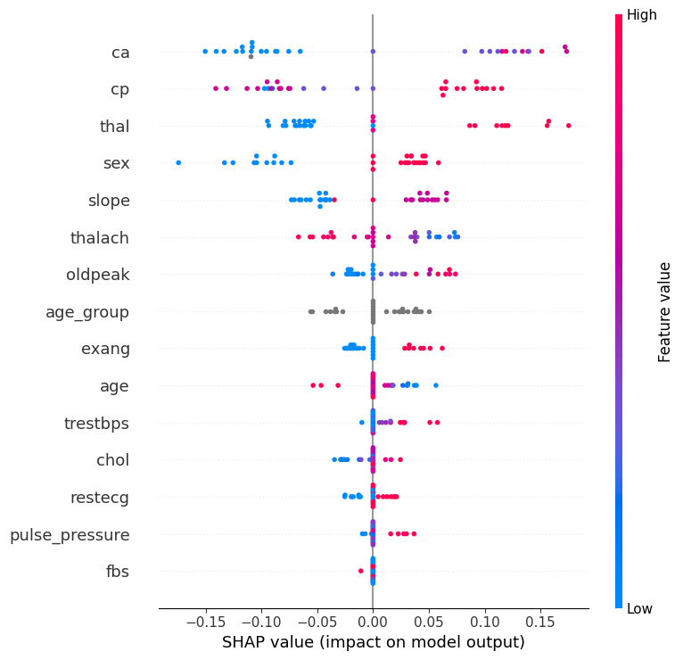
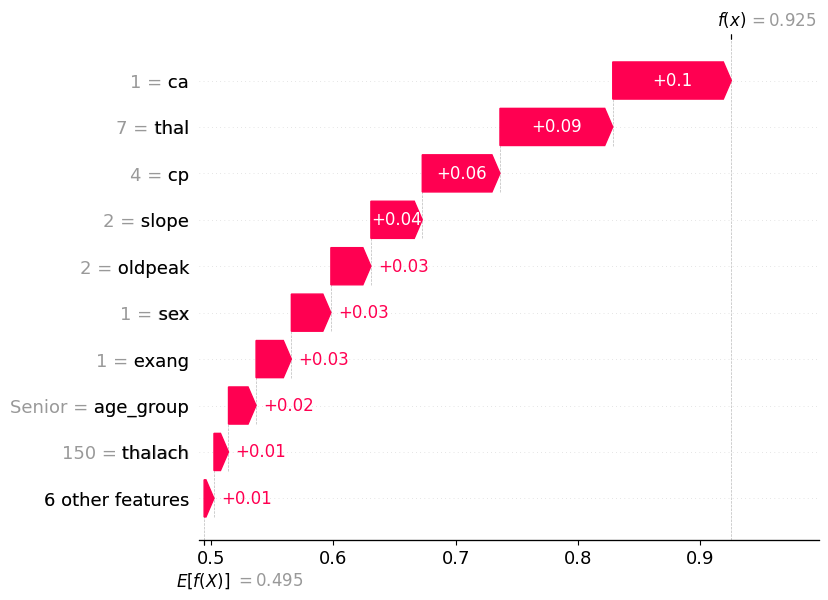

# ML_2547259
# Heart Disease Prediction using Ensemble Machine Learning

## CIA 3 – ML for Social Good Ensemble Challenge

This project predicts whether a patient is at risk of heart disease using machine learning and ensemble learning techniques. It was developed for the **Mission Health** domain, where early disease prediction can support healthcare professionals in identifying high-risk patients and enabling timely medical intervention.

## Problem Statement

Heart disease is one of the leading causes of death worldwide. The objective of this project is to build a reliable prediction model that classifies whether a patient has heart disease based on clinical features and compare multiple machine learning models to identify the best-performing approach.

## Dataset

- **Dataset:** UCI Heart Disease Dataset (Cleveland)
- **Source:** UCI Machine Learning Repository
- **Target Variable:** `target`
  - `0` – No Heart Disease
  - `1` – Heart Disease

## Technologies Used

- Python
- Pandas
- NumPy
- Matplotlib
- Scikit-learn
- XGBoost
- SHAP

## Project Workflow

1. Data cleaning and preprocessing
2. Exploratory Data Analysis (EDA)
3. Feature engineering
4. Train-test split
5. Model training
   - Logistic Regression
   - Random Forest
   - XGBoost
   - Stacking Ensemble
6. Model evaluation
7. SHAP explainability
8. Synthetic patient prediction

## Model Performance

| Model | Accuracy | Precision | Recall | F1-Score | ROC-AUC |
|-------|---------:|----------:|--------:|---------:|---------:|
| Logistic Regression | 0.869 | 0.833 | 0.893 | 0.862 | 0.971 |
| Random Forest | 0.902 | 0.844 | 0.964 | 0.900 | 0.939 |
| XGBoost | 0.869 | 0.812 | 0.929 | 0.867 | 0.940 |
| **Stacking Ensemble** | **0.902** | **0.844** | **0.964** | **0.900** | **0.958** |

## Results

### Heart Disease Class Distribution



### Correlation Matrix



### Comparison of Evaluation Metrics Across Models



### Stacking Ensemble – Confusion Matrix



### Stacking Ensemble – ROC Curve



### Random Forest – Top 10 Important Features



### SHAP Summary Plot



### SHAP Waterfall Plot



## Explainability

SHAP was used to explain the final model.

- SHAP Summary Plot for global feature importance
- SHAP Waterfall Plot for individual predictions
- Synthetic patient prediction explanation

## Project Structure

```text
Heart_Disease_CIA3/
│
├── Heart_Disease_Prediction.ipynb
├── README.md
├── Ethics_Statement.pdf
├── Results/
│   ├── Accuracy_Comparison.png
│   ├── Metrics_Comparison.png
│   ├── SHAP_Summary.png
│   ├── SHAP_Waterfall.png
│   └── Synthetic_SHAP.png
└── Heart_Disease_Demo.mp4
```

## How to Run

1. Clone the repository.
2. Install the required libraries.

```bash
pip install pandas numpy matplotlib scikit-learn xgboost shap
```

3. Open `Heart_Disease_Prediction.ipynb`.
4. Run all notebook cells sequentially.

## Key Outcomes

- Leakage-safe preprocessing pipeline
- Comparison of baseline and ensemble models
- Best model: Stacking Ensemble (90.2% accuracy)
- SHAP-based explainability
- Live prediction using a synthetic patient

## Responsible Use

This project is intended for educational purposes. Predictions should support—not replace—clinical decision-making, and healthcare professionals should always validate the results.

## Dataset Citation

Janosi, A., Steinbrunn, W., Pfisterer, M., & Detrano, R. (1988). **Heart Disease Dataset.** UCI Machine Learning Repository.
